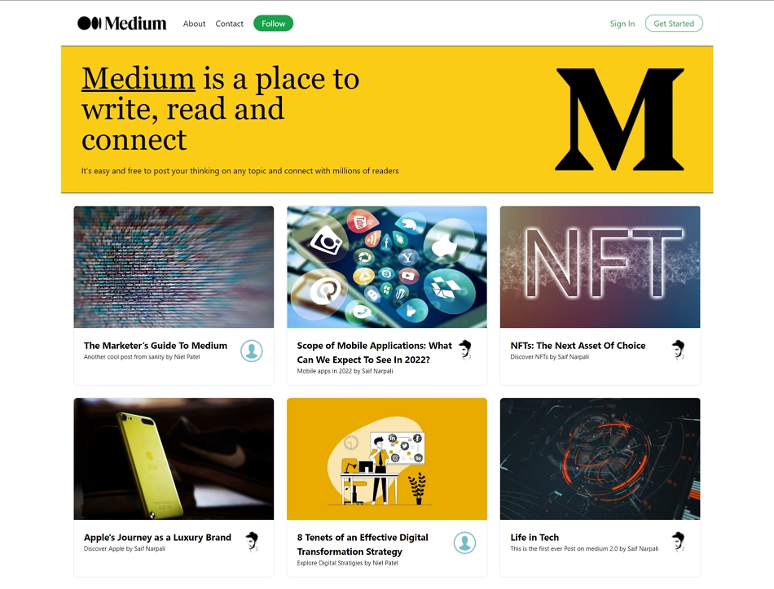

# Medium 2.0

## Table of contents

- [Overview](#overview)
  - [Preview](#preview)
  - [Links](#links)
- [My process](#my-process)
  - [Built with](#built-with)
  - [What I learned](#what-i-learned)
  - [Continued development](#continued-development)
  - [Useful resources](#useful-resources)
- [Author](#author)

## Overview

### Preview

### Links

- Live Site URL: [Medium 2.0](https://medium-2-0-sage.vercel.app/)

## My process

### Built with

- NextJs
- Sanity
- Tailwind CSS
- Mobile first workflow

### What I learned

- Some hands on experience creating responsive layout with Tailwind CSS in Nextjs framework.
- Fetching application data width SSR & SSG .
- Easily creating quick backend with sanity.
- FullStack development process.
- Nextjs folder and project structure

### Continued development

1. Nextjs
1. Sanity
1. TailwindCSS
1. Consuming APIs

### Useful resources

- [Conquering Responsive Layouts](https://courses.kevinpowell.co) - This helped me to have a deeper understanding of making responsive layouts
- [JavaScript Mastery](https://www.youtube.com/channel/UCmXmlB4-HJytD7wek0Uo97A) - Adrian Hajdin has been an excellent resource to help me practice with great and professional projects, check out his YouTube Channel for more..
- [Kevin Powell](https://www.youtube.com/watch?v=0ohtVzCSHqs&t=1s) - Kevin is the reason why i started using mobile first approach after watching this video where he explains how websites are responsive by default and its us who make it not responsive also his channel is a great resource for quick css tips and tricks!

## Author

- Frontend Mentor - [@SaifN97](https://www.frontendmentor.io/profile/SaifN97)
- Instagram - [@saif.codes\_](https://www.instagram.com/saif.codes_)
- Twitter - [@NarpaliSaif](https://twitter.com/NarpaliSaif)
